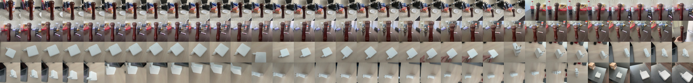

# Assignment 1 - Object Detection

## Abstract
In this Github repository, two pre-trained object detection models, Faster RCNN and YOLOv8, were evaluated on a custom dataset, collected by me. 
I have used as pre-trained models to detect new objects to reduce the time and effort needed to train a model from scratch.

At the end I get these results: YOLOv8 performed better in detecting small objects, while Faster RCNN was more confident in detecting objects with precise bounding boxes.

## Task description
1. Take photos of your environment of two or more objects. (at least 100 instances between all objects)
2. Annotate them on roboflow.
3. Train a Faster RCNN model using detectron2
4. Train Yolov4/5/6/7/8 (only one of them of choice) the smallest size
5. Evaluate both models based on mAP and speed and size.

## Process
### 1. Data collection
I collected data of 3 objects: a pepperjack, an Apple charger.

For collecting data, I used iPhone 12 and burst camera mode. 
This allowed me to take a quick photo of the objects from different angles and distances.

I took ~70 photos of each object.

### 2. Data annotation
I annotated the data using roboflow.