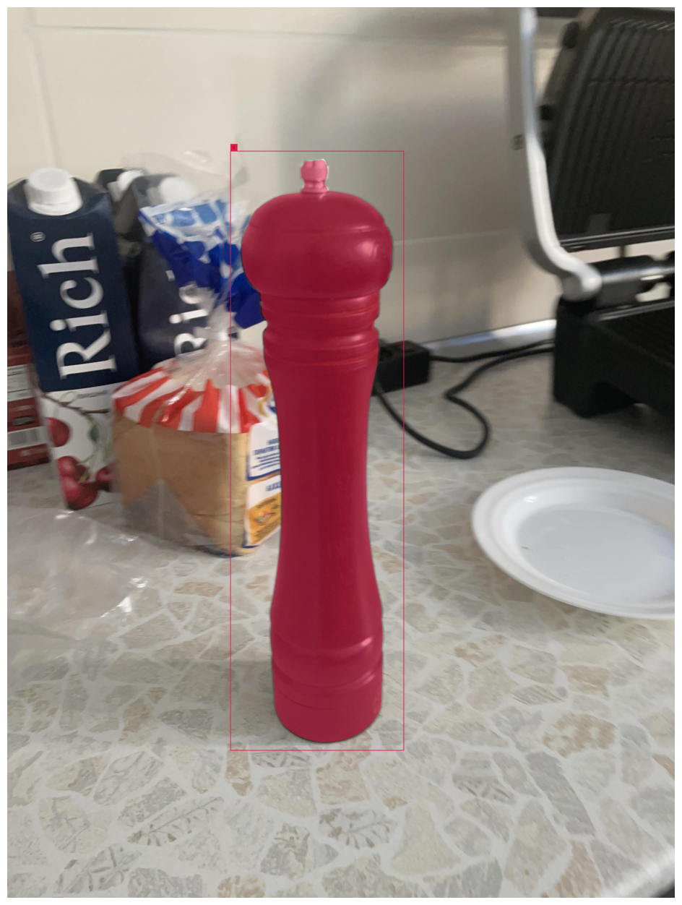

# Assignment 2 - Instance Segmentation

## Task description
1. Take photos of your environment of two or more objects. (at least 100 instances between all objects, photos from Assignment 1 can be used)
2. Annotate them on Roboflow for segmentation
3. Train a Mask RCNN model using detectron2
4. Train Yolov8 the smallest size for segmentation
5. Evaluate both models based on mAP and speed and size

## Process
### 1. Data collection
I used [collected dataset from Assignment 1](../object_detection#1-data-collection) of 2 objects: a pepperjack, an Apple charger.

### 2. Data annotation
I used detection annotations from [Assignment 1](../object_detection#2-data-annotation).

For segmentation annotations I used [Segment Anything Model (SAM)](https://github.com/facebookresearch/segment-anything) by Meta.

