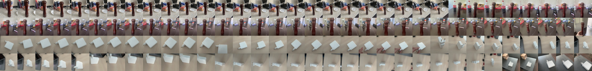

# Assignment 1 - Object Detection

https://colab.research.google.com/drive/1AzNwCGwSWpE7icPGXlgtyM0LsVgyGale?usp=sharing

## Task description
1. Take photos of your environment of two or more objects. (at least 100 instances between all objects)
2. Annotate them on roboflow.
3. Train a Faster RCNN model using detectron2
4. Train Yolov4/5/6/7/8 (only one of them of choice) the smallest size
5. Evaluate both models based on mAP and speed and size.

## Process
### 1. Data collection
I collected data of 2 objects: a pepperjack, an Apple charger.

For collecting data, I used iPhone 12 and burst camera mode. 
This allowed me to take a quick photo of the objects from different angles and distances.

I took ~70 photos of each object.

### 2. Data annotation
I annotated the data using roboflow.

When I was at school (and the last current YOLO was v3), markup was done via the labelimg utility, and it was hell. On the other hand, Roboflow's platform offered an intuitive, user-friendly environment for managing computer vision datasets, significantly streamlining my workflow.

### 3. Data augmentation
I used Roboflow's augmentation feature to increase the size of the dataset.

Roboflow's data augmentation feature was particularly impressive. The diverse range of augmentation techniques available, such as rotations, flips, and color alterations, helped improve my model's accuracy and generalization.

First time I used this settings:

Then I used this settings:

This settings gave me better results.

I think, that is because it was hard to for model, which was trained on small dataset, detect objects in noisy images.

### 4. Training
I trained Faster RCNN model using detectron2 and YOLOv8 using Ultralytics' toolbox.

More information about models you can find in notebooks.

I used Google Colab for training, because it is free and has GPU.

### 5. Evaluation
I evaluated both models based on mAP and speed.

The mAP for object detection is the average of the AP calculated for all the classes. mAP@0.5 (or mAP50) means that it is the mAP calculated at IOU threshold 0.5.

| Model | mAP50 | Training Speed | Inference Speed |
| --- | --- | --- | --- |
| YOLOv8 | 0.995 | 25 epochs completed in 6 mins | 7.2 ms |
| Faster RCNN | 0.865 | 300 iterations in 5 mins | 99.7 ms |

I trained only 300 iterations of Faster RCNN, because first I trained it for 1500 iterations, but it was so slow (30 mins), and I achieved only same mAP. But I lost this model, so I trained it again for 300 iterations.

Also I tried YOLOv8 on real-time video stream, and it worked well.

## Conclusion
In this assignment, we have successfully implemented and compared two state-of-the-art object detection models, Faster RCNN and YOLOv8, on a custom dataset. The dataset was collected and annotated using iPhone 12 and Roboflow's platform, which significantly streamlined the process. Data augmentation techniques were applied to enhance the dataset and improve the models' accuracy and generalization capabilities.

In conclusion, the choice of the object detection model depends on the specific requirements and constraints of a given application. YOLOv8 is better at detecting objects on video and is faster in both training and inference. However, Faster RCNN demonstrated more confidence in detecting objects with precise bounding boxes. It is essential to consider the trade-offs between speed, accuracy, and precision when selecting an object detection model for a particular task.
